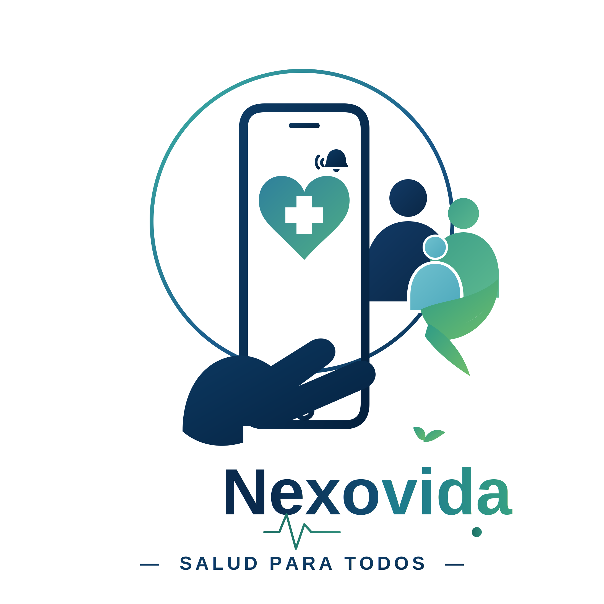
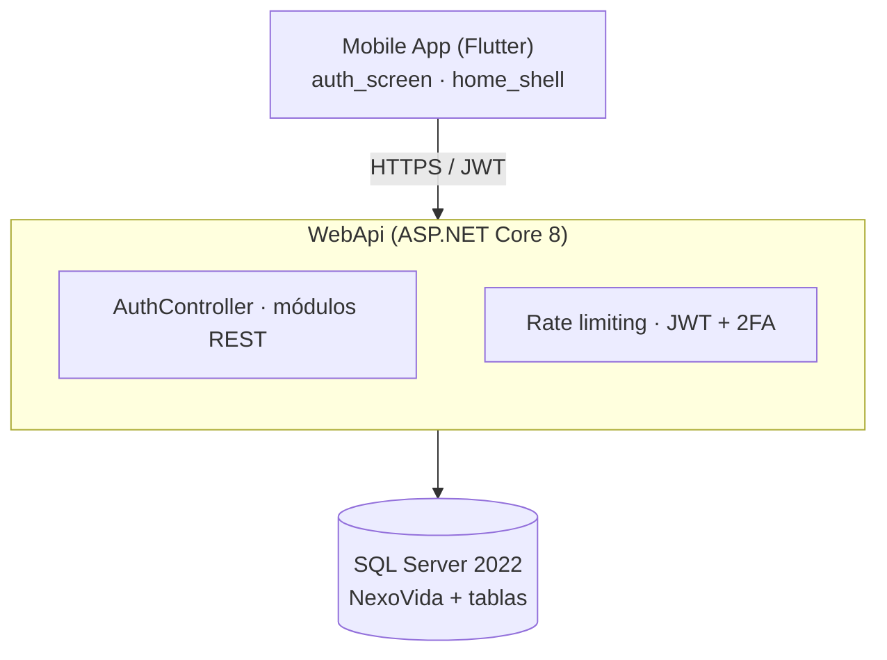
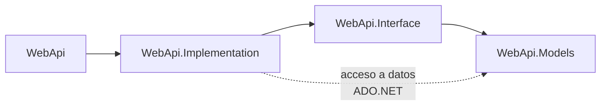

<div align="center">
  
</div>

# NexoVida

> Reconectando el cuidado: acompañamiento y seguimiento continuo de pacientes con enfermedades crónicas o discapacidad, donde **pacientes, familiares, profesionales de la salud y administradores** convergen en un único ecosistema.

Solución digital que mantiene el control del tratamiento y la monitorización de la salud mediante recordatorios inteligentes, seguimiento compartido con familiares o cuidadores, indicadores de salud y alertas preventivas que fortalecen la adherencia al tratamiento, la continuidad del cuidado y la atención oportuna.

[](https://github.com/Abemilek/nexovida/actions/workflows/backend-ci.yml)
[](https://github.com/Abemilek/nexovida/actions/workflows/mobile-ci.yml)
[](https://dotnet.microsoft.com)
[](https://learn.microsoft.com/dotnet/csharp)
[](https://flutter.dev)
[](https://dart.dev)
[](https://www.microsoft.com/sql-server)
[](https://www.docker.com)

---

## Tabla de contenidos

- [Características](#características)
- [Arquitectura](#arquitectura)
- [Roles y permisos](#roles-y-permisos)
- [Stack tecnológico](#stack-tecnológico)
- [Estructura del repositorio](#estructura-del-repositorio)
- [Inicio rápido](#inicio-rápido)
- [Seguridad](#seguridad)
- [CI/CD](#cicd)
- [Documentación](#documentación)
- [Agradecimientos](#agradecimientos)

---

## Características

| Característica | Descripción |
|---|---|
| **Recordatorios inteligentes** | Toma puntual de medicamentos con repetición configurable y estado de completado |
| **Indicadores de salud** | Registro de mediciones por tipo de indicador con valores primarios y secundarios |
| **Alertas preventivas** | Generación automática ante indicadores fuera de rango o recordatorios no completados |
| **Citas y asignaciones** | Agenda de citas, asignación a profesionales y tipos virtual/presencial |
| **Tratamientos y medicamentos** | Catálogo de medicamentos, esquemas de dosis, frecuencia y vía de administración |
| **Historial del paciente** | Línea de tiempo de eventos (citas, tratamientos, alertas) por paciente |
| **Cuidado compartido** | Familiares y cuidadores con acceso de solo lectura sobre indicadores y alertas |
| **Autenticación con roles** | JWT + refresh tokens, 2FA (TOTP), rate limiting y permisos por rol |

## Arquitectura



El backend se organiza en **capas con dependencias unidireccionales** (ver [`backend/README.md`](backend/README.md)):



| Capa | Responsabilidad |
|---|---|
| `WebApi.Models` | Entidades de dominio puras (POCOs), sin dependencias externas |
| `WebApi.Interface` | Contratos de servicio |
| `WebApi.Implementation` | Lógica de negocio + acceso a datos (ADO.NET / `Microsoft.Data.SqlClient`) |
| `WebApi` | Presentación REST: controllers, JWT, CORS, Swagger, rate limiting y middleware de seguridad |

## Roles y permisos

| Rol | Indicadores | Alertas | Recordatorios | Citas | Lectura de datos del paciente |
|---|---|---|---|---|---|
| **Admin** | Sí | Sí | Sí | Sí | Sí |
| **Profesional** | Registro | Atiende | — | Agenda | Sí |
| **Familiar** | Solo lectura | Solo lectura | — | — | Sí |
| **Paciente** | Registro | Lectura | Completar | Sí | Sí (propios) |

Los accesos se validan por **rol + scope de datos** (p. ej. un familiar solo ve a sus pacientes vinculados y las alertas se le presentan legibles pero sin acciones destructivas). El servidor refuerza cada permiso: ninguna acción sensible depende solo de la UI.

## Stack tecnológico

| Capa | Tecnología |
|---|---|
| **API** | ASP.NET Core 8 (`net8.0`, C#, controllers REST) |
| **Autenticación** | JWT Bearer (HS256), refresh tokens, 2FA TOTP (RFC 6238) |
| **Base de datos** | SQL Server 2022 (ADO.NET, scripts `.sql` idempotentes) |
| **App móvil** | Flutter 3.44 / Dart 3.9 (Linux, Android, Windows y Web) |
| **Infraestructura** | Docker Compose (SQL Server 2022 + API) |
| **CI/CD** | GitHub Actions (backend + móvil) |

## Estructura del repositorio

```
.
├── .github/
│   └── workflows/
├── backend/
│   ├── NexoVida.sln
│   ├── Scripts/
│   └── WebApi/
├── compose.yaml
├── docs/
├── mobile/
├── CONTRIBUTING.md
└── README.md
```

| Carpeta / Archivo | Contenido |
|---|---|
| `.github/workflows/` | CI: `backend-ci.yml` · `mobile-ci.yml` |
| `backend/` | API ASP.NET Core 8 — ver [`backend/README.md`](backend/README.md) |
| `backend/Scripts/` | `NexoVida.sql` (esquema) y `NexoVida.seed.sql` (datos) |
| `backend/WebApi/` | `WebApi` · `WebApi.Models` · `Services/` |
| `compose.yaml` | SQL Server 2022 + API (context: `backend`) |
| `docs/` | Documentación y assets (logo, diagramas) |
| `mobile/` | App Flutter — ver [`mobile/README.md`](mobile/README.md) |

## Inicio rápido

**Requisitos:** Docker, .NET 8 SDK y Flutter (`sdk: ^3.9.0`).

```bash
# 1. Clonar
git clone git@github.com:Abemilek/nexovida.git && cd nexovida

# 2. Entorno: copia el template. Corres en Development por defecto; en producción
#    pon un JWT_SECRET_KEY aleatorio (≥32 caracteres) y DB_SA_PASSWORD fuerte.
cp backend/.env.example backend/.env

# 3. Levantar SQL Server 2022 + seed + API (servicios: api · db · db-init)
docker compose --env-file backend/.env up --build

# 4. (opcional) API con `dotnet watch` apuntando a un SQL Server local
cd backend && dotnet run --project WebApi/WebApi.csproj

# 5. App móvil (Flutter)
cd mobile && flutter pub get && flutter run
```

La API queda en `http://localhost:5005` (`dotnet run`) o `http://localhost:8080` (Docker); Swagger en `/swagger` (solo Development).

### Cuentas de demostración

Todas las cuentas del seed comparten la contraseña `nexovida-project`:

| Cuenta | Rol |
|---|---|
| `admin@nexovida.com` | Administración |
| `mgonzalez@correo.com` | Profesional de salud |
| `jperez@correo.com` | Familiar / cuidador |
| `rgonzalez@correo.com` | Paciente |

## Seguridad

- **JWT ajustado a OWASP**: valida firma, issuer, audience y expiración; `ClockSkew` de 30s; solo `HS256` (anti *alg confusion*); los tokens expirados devuelven mensajes accionables.
- **Refresh tokens** para renovación sin re-autenticar; **2FA TOTP** (RFC 6238) configurable por usuario.
- **Rate limiting por IP**: 100 req/min global y **5 req/min** en `/api/auth/*` contra fuerza bruta.
- **Fallback policy**: todo endpoint exige autenticación por defecto; solo `[AllowAnonymous]` explícito abre rutas (login, alta de usuario).
- **Middleware de seguridad**: manejo global de excepciones, headers de seguridad, sanitización de requests y HSTS fuera de Development.
- **Swagger solo en Development** y CORS por lista blanca (`Cors:AllowedOrigins`).
- En **Production no arranca** si `Jwt:Key` sigue en la plantilla `CHANGE_ME`.

## CI/CD

| Workflow | Qué valida |
|---|---|
| [`backend-ci.yml`](.github/workflows/backend-ci.yml) | `dotnet restore` · `dotnet build` (rutas `backend/**`) |
| [`mobile-ci.yml`](.github/workflows/mobile-ci.yml) | `flutter pub get` · `flutter analyze` · `dart format --set-exit-if-changed` · `flutter test` · build APK debug (rutas `mobile/**`) |

## Documentación

- [**Backend** — `backend/README.md`](backend/README.md): arquitectura por capas, paquetes NuGet, variables de entorno, endpoints con ejemplos `curl` y flujo de autenticación/2FA.
- [**Mobile** — `mobile/README.md`](mobile/README.md): estructura de la app Flutter, dependencias, configuración de URLs y navegación por rol.
- [**Despliegue** — `docs/DEPLOYMENT.md`](docs/DEPLOYMENT.md): ejecución y puesta en producción (Docker Compose, variables de entorno, checklist de seguridad y troubleshooting).
- [**Contributing** — `CONTRIBUTING.md`](CONTRIBUTING.md): convenciones de ramas, commits y guías del proyecto.
- [**Scripts de BD** — `backend/Scripts/`](backend/Scripts/): esquema (`NexoVida.sql`) y datos de ejemplo (`NexoVida.seed.sql`).

## Agradecimientos

Las decisiones de seguridad de la API (autenticación, rate limiting, manejo de errores y fallback policy) se diseñaron siguiendo las recomendaciones del **[OWASP API Security Project](https://owasp.org/www-project-api-security/)**. Agradecemos a la comunidad OWASP por mantener de forma abierta y gratuita una de las referencias más completas para el diseño seguro de APIs.

---

<div align="center">
  Hecho con dedicación para los que cuidan y los que necesitan cuidado.<br/>
  <sub>NexoVida · monorepo ASP.NET Core 8 + Flutter</sub>
</div>