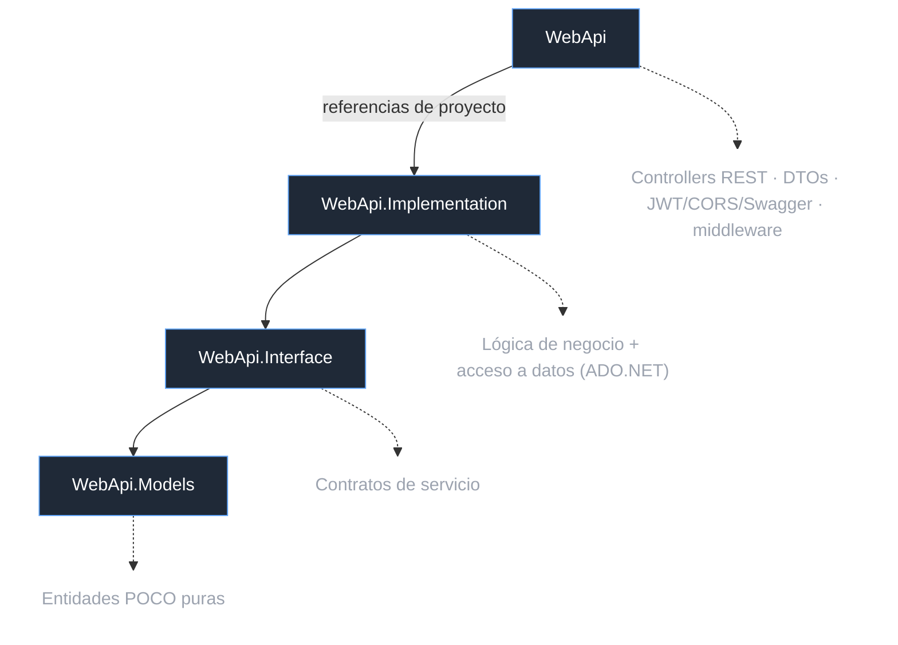
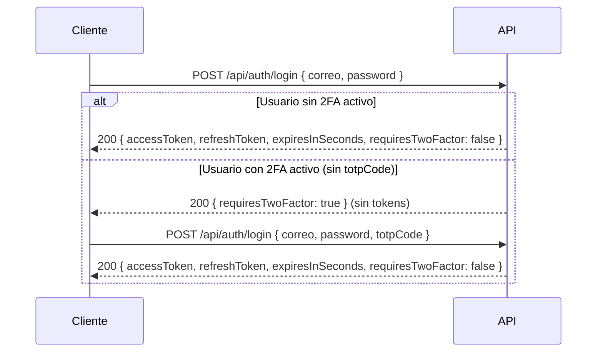

# NexoVida — Backend API

[](https://dotnet.microsoft.com)
[](https://learn.microsoft.com/dotnet/csharp)
[](https://swagger.io)
[](https://www.microsoft.com/sql-server)

API REST del **ecosistema NexoVida** construida con **ASP.NET Core 8**. Expone más de 20 módulos de negocio (medicamentos, tratamientos, citas, recordatorios, indicadores de salud, alertas, historial…) con autenticación **JWT + refresh tokens + 2FA (TOTP)**, rate limiting y una pipeline de seguridad alineada con OWASP.

Volver al [README raíz](../README.md).

---

## Tabla de contenidos

- [Arquitectura](#arquitectura)
- [Estructura del repositorio](#estructura-del-repositorio)
- [Relación entre capas](#relación-entre-capas)
- [Paquetes NuGet](#paquetes-nuget)
- [Configuración y variables de entorno](#configuración-y-variables-de-entorno)
- [Autenticación y 2FA](#autenticación-y-2fa)
- [Rate limiting](#rate-limiting)
- [Seguridad](#seguridad)
- [Endpoints REST](#endpoints-rest)
- [Ejemplos con cURL](#ejemplos-con-curl)
- [Scripts de base de datos](#scripts-de-base-de-datos)
- [Ejecución](#ejecución)

---

## Arquitectura

API en **capas** con dependencias unidireccionales:



Reglas:
- **WebApi.Models**: entidades puras (POCOs), sin dependencias externas.
- **WebApi.Interface**: contratos de servicio (`IUsuarioService`, `IRolService`, …). Depende solo de `WebApi.Models`.
- **WebApi.Implementation**: implementa la lógica de negocio, contiene el acceso a datos con ADO.NET/`Microsoft.Data.SqlClient`. Depende de `WebApi.Interface`.
- **WebApi**: expone los controllers REST, configura JWT, CORS, rate limiting, middleware de seguridad y Swagger. Depende de `WebApi.Implementation` y `WebApi.Interface`.

Los **roles no se resuelven en la capa de datos**: la autorización se aplica en los controllers con `[Authorize(Roles = …)]` y con scopes de datos (un familiar solo ve a sus pacientes vinculados; un profesional no agenda citas ajenas; etc.).

## Estructura del repositorio


| Carpeta / Archivo | Contenido |
|---|---|
| `Scripts/` | `NexoVida.sql` y `NexoVida.seed.sql` |
| `WebApi/Controllers/` | Controllers REST + `AuthController` |
| `WebApi/Dto/` | Data Transfer Objects |
| `WebApi/Filters/` | `ModelValidationFilter` |
| `WebApi/Middleware/` | Excepciones · headers de seguridad · sanitización |
| `WebApi/Properties/launchSettings.json` | Configuración de perfiles de ejecución |
| `WebApi/Program.cs` | Bootstrap: JWT, CORS, rate limiting, Swagger, DI |
| `WebApi/appsettings.json` | Configuración compartida |
| `WebApi/appsettings.Development.json` | Configuración de entorno de desarrollo |
| `WebApi.Models/` | Entidades de dominio (POCO) |
| `Services/WebApi.Interface/` | Interfaces (contratos de servicio) |
| `Services/WebApi.Implementation/` | Implementación + acceso a datos (ADO.NET) |


## Paquetes NuGet

**WebApi** (`net8.0`)

| Paquete | Versión | Uso |
|---------|---------|-----|
| `Microsoft.AspNetCore.Authentication.JwtBearer` | 8.0.11 | Validación de bearer tokens |
| `Swashbuckle.AspNetCore` | 6.9.0 | Swagger / OpenAPI (`/swagger`) |
| `System.IdentityModel.Tokens.Jwt` | 8.2.1 | Creación/lectura de JWT |

**WebApi.Implementation** (`net8.0`)

| Paquete | Versión | Uso |
|---------|---------|-----|
| `Microsoft.Data.SqlClient` | 5.2.2 | Acceso a datos ADO.NET (SNI compatible Linux/macOS) |
| `Microsoft.AspNetCore.Authentication.JwtBearer` | 8.0.11 | Claims/roles en la lógica de negocio |
| `Microsoft.Extensions.Configuration` | 9.0.0 | Lectura de configuración |
| `System.IdentityModel.Tokens.Jwt` | 8.2.1 | Generación de refresh tokens |

**WebApi.Models** y **WebApi.Interface** no tienen dependencias de paquete (solo `net8.0` + referencias de proyecto).

## Configuración y variables de entorno

Todo valor vive en `appsettings.json` y puede sobrescribirse con **variables de entorno** usando la notación de doble guion bajo (`Jwt__Key`); las variables de entorno se cargan después de `appsettings.json`, así que ganan la precedencia. En producción, **nunca** uses `appsettings.json` para secretos.

> Con Docker Compose estas variables se leen del `.env` del compose y se re-mapean en `compose.yaml`: `DB_SA_PASSWORD`, `CONNECTION_STRING` (→ `ConnectionStrings__DatabaseConnection`), `JWT_SECRET_KEY` (→ `Jwt__Key`), `JWT_ISSUER`, `JWT_AUDIENCE` y `CORS_ALLOWED_ORIGIN` (→ `Cors__AllowedOrigins__0`).

| Variable de entorno | Clave `appsettings` | Descripción | Requerida |
|---------------------|---------------------|-------------|-----------|
| `Jwt__Key` | `Jwt:Key` | Clave de firma HS256, **≥ 32 caracteres**. La plantilla `CHANGE_ME_…` **impide arrancar en Production**. | Sí (producción) |
| `Jwt__Issuer` | `Jwt:Issuer` | Emisor del token (default `NexoVida`) | No |
| `Jwt__Audience` | `Jwt:Audience` | Audiencia del token (default `NexoVida`) | No |
| `ConnectionStrings__DatabaseConnection` | `ConnectionStrings:DatabaseConnection` | Cadena de conexión SQL Server (TrustServerCertificate) | Sí |
| `Cors__AllowedOrigins` | `Cors:AllowedOrigins` | Orígenes permitidos (default `http://localhost:3000`, `http://localhost:5173`) | No |

Ejemplo:

```bash
export Jwt__Key='una-clave-aleatoria-larga-de-al-menos-32-caracteres'
export ConnectionStrings__DatabaseConnection='Server=localhost,1433;Database=NexoVida;User Id=sa;Password=...;TrustServerCertificate=True;'
dotnet run
```

## Autenticación y 2FA

El flujo de sesión usa **access tokens** cortos (15 min) + **refresh tokens** (7 días) con **rotación** (cada refresh revoca el anterior, detectando reuso como señal de robo).

### Flujo de login (1 o 2 pasos)



Endpoints del módulo auth (todas las rutas bajo `/api/auth`):

| Método | Ruta | Acceso | Descripción |
|--------|------|--------|-------------|
| `POST` | `/api/auth/login` | anónimo | Login 1 o 2 pasos (TOTP opcional en el body) |
| `POST` | `/api/auth/refresh` | anónimo | Renueva tokens con un refresh token válido (rota el anterior) |
| `POST` | `/api/auth/logout` | anónimo | Revoca el refresh token (cierra sesión server-side) |
| `GET` | `/api/auth/me` | autenticado | Contexto: roles, `twoFactorEnabled`, `idPaciente`/`idFamiliar`/`idProfesional` |
| `POST` | `/api/auth/2fa/setup` | autenticado | Genera secreto TOTP + URI `otpauth://` (guard: rechaza si ya está activo) |
| `POST` | `/api/auth/2fa/verify` | autenticado | Confirma el primer código y activa el 2FA |
| `POST` | `/api/auth/2fa/disable` | autenticado | Desactiva el 2FA |

Reglas de seguridad del login:
- **Mismo error genérico** (`Correo o contrasena incorrectos.`) si el correo no existe o la contraseña falla (anti *user enumeration*).
- Verificación **PBKDF2 ficticia** cuando la cuenta no existe para igualar el tiempo de respuesta (anti *timing attack*).
- El 2FA **no queda activo** hasta confirmar un código válido en `/2fa/verify`; si nunca lo confirmas, el secreto generado en `/2fa/setup` se ignora.

## Rate limiting

Definido en `Program.cs` con `System.Threading.RateLimiting` (política por IP).

| Política | Límite | Ámbito |
|----------|--------|--------|
| **Global** | 100 req/min por IP, cola de 10 | Toda la API |
| **`auth`** | 5 req/min por IP, sin cola | `/api/auth/*` (vía `[EnableRateLimiting("auth")]`) |

Rechazo con `429 Too Many Requests` (`RejectionStatusCode`). El cliente móvil traduce el 429 en un mensaje legible.

## Seguridad

Pipeline (orden importa): middleware de excepciones/headers/sanitización → HSTS + redirección HTTPS (no Development) → routing → rate limiting → CORS → Swagger (solo Development) → auth → authorization → controllers.

- **Fallback authorization policy**: **todo** endpoint exige autenticación por defecto; solo los `[AllowAnonymous]` explícitos abren rutas (login, alta de usuario). Esto cerró 100+ endpoints que estaban abiertos.
- **JWT validado contra OWASP**: firma, issuer, audience y lifetime con `ClockSkew` de 30 s; solo `HS256` (`ValidAlgorithms`) para evitar *alg confusion*; mensajes accionables para tokens vencidos (`tokenExpired: true`).
- **Claves ficticias** de `CHANGE_ME` matan el arranque en Production.
- **HSTS** (365 días, `includeSubDomains`) fuera de Development.
- **Password hashing PBKDF2** con salt por usuario; nunca se almacenan hashes sin salt.

## Endpoints REST

Cada módulo sigue el patrón CRUD REST (convención del `WebApi.http`): `GET /`, `GET /{id}`, `POST /`, `PUT /{id}`, `DELETE /{id}`.

| Módulo | Ruta base | Notas |
|--------|-----------|-------|
| Usuarios | `/api/Usuario` | `POST` público (registro) |
| Roles | `/api/rol` · `/api/usuariorol` | Asignación de roles |
| Perfiles / Enfermedades | `/api/perfil` · `/api/enfermedad` · `/api/pacienteenfermedad` | |
| Pacientes | `/api/paciente` | |
| Profesionales | `/api/profesionalsalud` | |
| Familiares | `/api/familiar` | |
| Asistentes | `/api/asistentepaciente` | |
| Medicamentos | `/api/medicamento` | baja lógica (`activo`) |
| Tratamientos | `/api/tratamiento` | |
| Tratamiento-Medicamento | `/api/tratamientomedicamento` | |
| Citas | `/api/cita` | |
| Asignación de citas | `/api/asignarcita` | Profesional ↔ cita |
| Recordatorios | `/api/recordatorio` · `POST /api/recordatorio/{id}/completar` | baja lógica |
| Tipos de indicador | `/api/tipoindicadorsalud` | |
| Indicadores de salud | `/api/indicadorsalud` | registro de mediciones |
| Alertas | `/api/alerta` | prioridad + lectura/atención |
| Historial del paciente | `/api/historialpaciente` | |
| Métricas | `/api/metrica` | |
| Configuración | `/api/configuracion` | |

Los ejemplos completos de request/response viven en [`WebApi/WebApi.http`](WebApi/WebApi.http) (playable en Visual Studio / Rider, host `http://localhost:5005`).

## Ejemplos con cURL

```bash
# Login (1 paso, sin 2FA) → guarda los tokens
curl -s -X POST http://localhost:5005/api/auth/login \
  -H 'Content-Type: application/json' \
  -d '{"correo":"mgonzalez@correo.com","password":"nexovida-project"}'
# → { "accessToken": "…", "refreshToken": "…", "expiresInSeconds": 900, "requiresTwoFactor": false }

# Login 2 pasos: primero se pide un código si el usuario tiene 2FA
curl -s -X POST http://localhost:5005/api/auth/login \
  -H 'Content-Type: application/json' \
  -d '{"correo":"admin@nexovida.com","password":"nexovida-project"}'
# → { "requiresTwoFactor": true }  (sin tokens)

# …y se reintenta con el TOTP de la app autenticadora
curl -s -X POST http://localhost:5005/api/auth/login \
  -H 'Content-Type: application/json' \
  -d '{"correo":"admin@nexovida.com","password":"nexovida-project","totpCode":"123456"}'

# Contexto del usuario autenticado (roles + vínculos de negocio)
curl -s http://localhost:5005/api/auth/me \
  -H "Authorization: Bearer $ACCESS_TOKEN"

# Renovar tokens (rota el refresh token anterior)
curl -s -X POST http://localhost:5005/api/auth/refresh \
  -H 'Content-Type: application/json' \
  -d "{\"refreshToken\":\"$REFRESH_TOKEN\"}"

# Módulo de ejemplo: registrar un indicador de salud (autenticado)
curl -s -X POST http://localhost:5005/api/indicadorsalud \
  -H 'Content-Type: application/json' \
  -H "Authorization: Bearer $ACCESS_TOKEN" \
  -d '{"idPaciente":1,"idTipoIndicador":2,"valor":110.0,"fechaHoraMedicion":"2026-08-23T07:00:00","fuente":"Manual"}'

# Marcar recordatorio como completado
curl -s -X POST http://localhost:5005/api/recordatorio/1/completar \
  -H "Authorization: Bearer $ACCESS_TOKEN"
```

## Scripts de base de datos

| Script | Contenido |
|--------|-----------|
| [`NexoVida.sql`](Scripts/NexoVida.sql) | Esquema completo (tablas, claves, identidades de dominio, seguridad) |
| [`NexoVida.seed.sql`](Scripts/NexoVida.seed.sql) | Datos de demostración: 4 usuarios (`nexovida-project`), medicamentos, tratamientos, citas, indicadores, alertas |

## Ejecución

```bash
# Requiere: .NET 8 SDK + SQL Server 2022 alcanzable en localhost:1433

cd backend
dotnet restore
dotnet build                      # 0 errores garantizados por CI
dotnet run --project WebApi/WebApi.csproj    # http://localhost:5005

# Modo watch (recarga en caliente)
dotnet watch run --project WebApi/WebApi.csproj
```

- **Swagger**: `http://localhost:5005/swagger` (solo Development).
- **Healthcheck**: `GET /health` -> `200 {"status":"ok"}` (endpoint anónimo reservado para orquestadores).
- **Docker**: el `compose.yaml` de la raíz levanta SQL Server 2022 + seed + API con tres servicios: `api` (:8080, healthcheck sobre `/health`), `db` (SQL Server 2022, puerto 1433 ligado solo a `localhost`) y `db-init` (ejecuta `Scripts/*.sql` una sola vez). Corre en **Development** por defecto (Swagger activo); para producción cambia `ASPNETCORE_ENVIRONMENT` y pon un `JWT_SECRET_KEY` real (≥32 caracteres):

  ```bash
  cp .env.example .env        # desde backend/ — edita con JWT_SECRET_KEY real
  docker compose --env-file backend/.env up --build   # desde la raíz
  ```

- **CI**: `.github/workflows/backend-ci.yml` corre `dotnet restore` + `dotnet build` sobre la ruta `backend/**`.