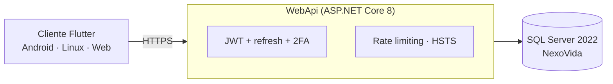
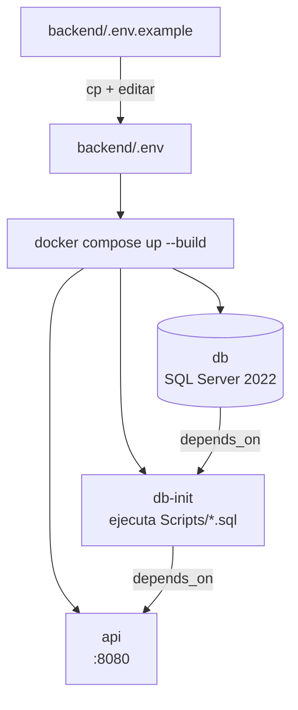

# NexoVida — Guía de Despliegue

Guía de ejecución y despliegue del ecosistema NexoVida (backend ASP.NET Core 8 + SQL Server 2022 + app Flutter) en ambientes de **desarrollo** y **producción**.

---

## Tabla de contenidos

- [Modelo de despliegue](#modelo-de-despliegue)
- [Configuración de entorno](#configuración-de-entorno)
- [Docker vs. local — diferencias clave](#docker-vs-local--diferencias-clave)
- [Despliegue con Docker Compose](#despliegue-con-docker-compose-recomendado)
- [Despliegue sin Docker](#despliegue-sin-docker-backends-nativos)
- [Checklist de seguridad en producción](#checklist-de-seguridad-en-producción)
- [App móvil (build de entrega)](#app-móvil-build-de-entrega)
- [Solución de problemas](#solución-de-problemas)

---

## Modelo de despliegue



| Componente | Qué es | Cómo se entrega |
|---|---|---|
| SQL Server 2022 | Base de datos (`NexoVida`) | Contenedor `mcr.microsoft.com/mssql/server:2022-latest` |
| Backend API | `WebApi` (`net8.0`) | Imagen Docker desde `backend/Dockerfile` (o `dotnet`) |
| App móvil | Flutter ≥ 3.44 / Dart ≥ 3.9 | APK manual (`flutter build apk`) o runner de escritorio/web |

## Configuración de entorno

Todas las variables se sobrescriben sobre `appsettings.json` con la notación de doble guion bajo. **Nunca** pongas secretos en `appsettings.json` en producción.

| Variable | Por defecto (compose) | Descripción | Crítica en prod |
|---|---|---|---|
| `DB_SA_PASSWORD` | `YourStrong!Passw0rd` | Password `sa` de SQL Server (complejidad: mayúscula+minúscula+número+símbolo, ≥8) | Sí |
| `CONNECTION_STRING` | `Server=db,1433;Database=NexoVida;User Id=sa;Password=…;TrustServerCertificate=True` | Cadena completa que recibe la API (mapeada a `ConnectionStrings__DatabaseConnection`); `Encrypt=False` evita handshake TLS con el cert autofirmado dentro de la red privada | Sí |
| `JWT_SECRET_KEY` | `change-this-to-a-long-…` | Clave de firma HS256 **≥ 32 caracteres** (mapeada a `Jwt__Key`). Con `CHANGE_ME` la API **no arranca** en producción (por diseño) | Sí |
| `JWT_ISSUER` / `JWT_AUDIENCE` | `NexoVida` | Emisor/audiencia del token | No |
| `CORS_ALLOWED_ORIGIN` | `http://localhost:3000` | Origen permitido por CORS (mapeado a `Cors__AllowedOrigins__0`) | Ajustar |
| `ASPNETCORE_ENVIRONMENT` | `Development` (por defecto) / `Production` | Habilita/deshabilita Swagger, detalle de errores, HSTS/HTTPS | Sí |

El template versionable es [`backend/.env.example`](../backend/.env.example). Copia, edita y **no subas** el `.env` real.

## Docker vs. local — diferencias clave

Las dos vías de ejecución no son intercambiables 1:1: cambian el puerto, si el seed corre solo o hay que correrlo a mano, y el entorno por defecto. Referencia rápida antes de elegir una:

| | Docker Compose | Local (`dotnet run`) |
|---|---|---|
| Puerto de la API | `8080` | `5005` |
| Base de datos | Contenedor `db` (SQL Server 2022), puerto `1433` ligado solo a `127.0.0.1` | Tu propia instancia de SQL Server 2022 en `localhost:1433` |
| Seed (`NexoVida.sql` + `NexoVida.seed.sql`) | **Automático** — lo corre el servicio `db-init` una sola vez | **Manual** — tenés que ejecutar ambos scripts vos mismo contra tu instancia |
| `ASPNETCORE_ENVIRONMENT` por defecto | `Development` (Swagger activo) salvo que lo cambies en `backend/.env` | El que vos exportes explícitamente (el ejemplo de esta guía usa `Production`) |
| Variables de entorno | Se leen de `backend/.env` y se re-mapean en `compose.yaml` | Se exportan a mano en tu shell (o `dotnet user-secrets`) |
| Uso recomendado | Entrega, demo para el jurado, cualquier entorno reproducible | Desarrollo activo del backend con recarga en caliente (`dotnet watch`) |

> Para la entrega académica, la vía recomendada es Docker Compose: un solo comando (`docker compose up --build`) deja la API, la base de datos y el seed listos sin pasos manuales adicionales.

## Despliegue con Docker Compose (recomendado)



```bash
# 1) Prepara tus secretos
cd nexovida
cp backend/.env.example backend/.env
#    edita backend/.env: JWT_SECRET_KEY=<secreto aleatorio de ≥32 caracteres>
#    y DB_SA_PASSWORD=<password fuerte> (CONNECTION_STRING debe usar la misma)

# 2) Levanta SQL Server 2022 + seed + API (build desde backend/Dockerfile)
docker compose --env-file backend/.env up --build -d

# 3) Estado y logs
docker compose ps
docker compose --env-file backend/.env logs -f api

# 4) Smoke test — healthcheck y login
curl -s http://localhost:8080/health
# → {"status":"ok",...}
curl -s http://localhost:8080/api/auth/login \
  -H 'Content-Type: application/json' \
  -d '{"correo":"admin@nexovida.com","password":"nexovida-project"}'
# → debe devolver accessToken/refreshToken (o requiresTwoFactor si activaste 2FA)
```

Servicios creados: `api` (:8080, healthcheck sobre `/health`), `db` (SQL Server 2022, puerto 1433 ligado solo a `127.0.0.1`) y `db-init` (ejecuta `backend/Scripts/*.sql` una sola vez; la API espera a que termine con `depends_on`).

> Detener: `docker compose down` · borrar también datos: `docker compose down -v` (elimina el volumen `nexovida-db-data`).

## Despliegue sin Docker (backends nativos)

```bash
# Requiere: .NET 8 SDK y un SQL Server 2022 accesible en localhost:1433
cd backend
dotnet restore
dotnet build -c Release
# DB: ejecuta Scripts/NexoVida.sql y Scripts/NexoVida.seed.sql contra tu instancia

# Variables (Linux)
export Jwt__Key='<secreto aleatorio de ≥32 caracteres>'
export ConnectionStrings__DatabaseConnection='Server=localhost,1433;Database=NexoVida;User Id=sa;Password=<tu-password>;TrustServerCertificate=True;'
export ASPNETCORE_ENVIRONMENT=Production

# --no-launch-profile ignora launchSettings.json (que forzaria Development)
dotnet run --project WebApi/WebApi.csproj --no-launch-profile
```

## Checklist de seguridad en producción

- [ ] `JWT_SECRET_KEY` es secreto, aleatorio y ≥ 32 caracteres (la API **falla a propósito** si sigue en `CHANGE_ME`).
- [ ] `DB_SA_PASSWORD` cambiada; el puerto 1433 no expuesto a Internet salvo necesidad (en el compose solo escucha en `127.0.0.1`).
- [ ] Detrás de un proxy HTTPS (nginx/Caddy/balanceador) que termine el TLS — el backend emite **HSTS** (365 días) y redirige a HTTPS.
- [ ] `CORS_ALLOWED_ORIGIN` / `Cors__AllowedOrigins` restringido a tu(s) dominio(s) real(es).
- [ ] Swagger deshabilitado en `Production` (se sirve solo en Development).
- [ ] Errores 500 devueltos sin detalle interno (solo `CorrelationId`) en Production.
- [ ] Rate limiting activo por IP: 100 req/min global y **5 req/min** en `/api/auth/*`.
- [ ] Sesión con expiración: access token 15 min + refresh token 7 días rotativo y revocable server-side.
- [ ] Backup programado del volumen/BD de SQL Server.
- [ ] `.env`, keystores y `appsettings.json` con secretos, fuera del control de versiones.

## App móvil (build de entrega)

```bash
cd mobile
flutter pub get
flutter analyze && flutter test

# APK Release (Android)
flutter build apk --release
# → build/app/outputs/flutter-apk/app-release.apk

# Escritorio linux o windows (runner)
flutter build linux
```

La app apunta al backend por `ApiConfig` (`lib/config/api_config.dart`):
`localDotnetBaseUrl` (127.0.0.1:5005), `dockerBaseUrl` (localhost:8080) o `androidEmulatorDotnetBaseUrl` (10.0.2.2:5005). Para producción, apunta a tu dominio; en `AppSession.login` se puede pasar una `baseUrl` alternativa sin recompilar.

## Solución de problemas

| Síntoma | Causa probable | Solución |
|---|---|---|
| El contenedor `api` reinicia siempre | `JWT_SECRET_KEY` con la plantilla `CHANGE_ME` en producción | Pon un secreto real en `backend/.env` (o cambia a `Development`) |
| Error 40 / `Could not open a connection to SQL Server` | Cliente SQL legacy (`System.Data.SqlClient`) o `appsettings.json` pisando a las env vars | El proyecto ya usa `Microsoft.Data.SqlClient` y las env vars ganan precedencia; verifica `CONNECTION_STRING` en `backend/.env` |
| 500 con `Invalid object name …` | Seed incompleto | `docker compose --env-file backend/.env down -v` y vuelve a `up --build` para re-ejecutar los scripts |
| La API responde 401 en login | Credenciales, o 2FA activo sin `totpCode` | Verifica el mensaje; usa el flujo de 2 pasos |
| `429 Too Many Requests` | Rate limiting (5/min en auth) | Espera y reintenta; no uses fuerza bruta |
| El seed no se ejecuta | `nexovida-db-init` corrió antes de que la BD estuviera lista | `docker compose down -v && docker compose --env-file backend/.env up --build` |
| La app no conecta | URL del backend incorrecta o CORS | Ajusta `ApiConfig` y `CORS_ALLOWED_ORIGIN` |
| Swagger vacío en prod | Swagger solo se sirve en Development | Esperado; usa otra herramienta de API docs en prod |

---

Enlace al [README raíz](../README.md) y a la [guía del backend](../backend/README.md).