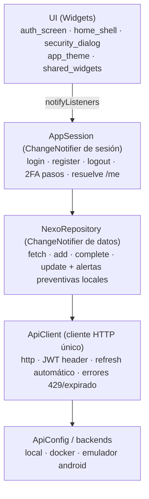
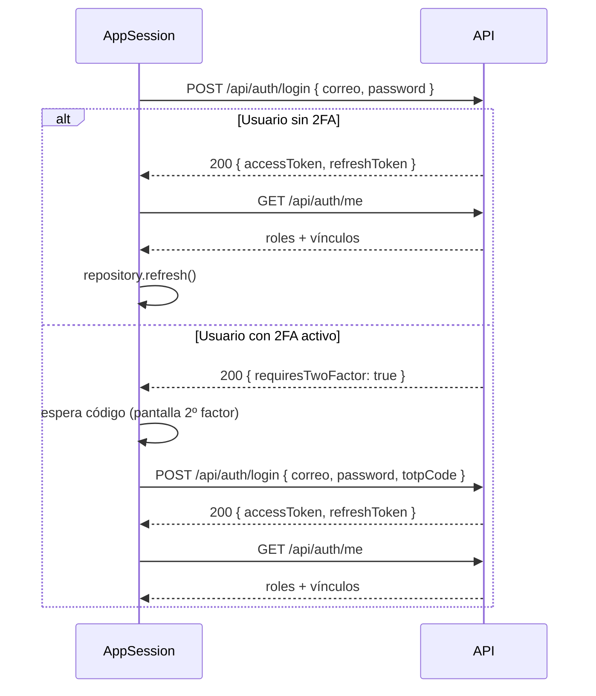

# NexoVida — App Móvil (Flutter)

[](https://flutter.dev)
[](https://dart.dev)
[](https://www.android.com)
[](https://flutter.dev)

Cliente móvil de **NexoVida** en **Flutter (Dart ≥ 3.9)**. La app gestiona sesión (JWT + refresh + **2FA TOTP**), navega por **rol de usuario** y consume los módulos de la API: recordatorios, indicadores de salud (con alertas preventivas locales), citas, alertas e historial clínico.

Volver al [README raíz](../README.md).

---

## Tabla de contenidos

- [Arquitectura](#arquitectura)
- [Estructura](#estructura)
- [Dependencias](#dependencias)
- [Configuración (URLs del backend)](#configuración-urls-del-backend)
- [Flujo de sesión y 2FA](#flujo-de-sesión-y-2fa)
- [Navegación por rol](#navegación-por-rol)
- [Módulos de datos](#módulos-de-datos)
- [Pruebas](#pruebas)
- [Ejecución](#ejecución)

---

## Arquitectura

La app separa **estado de sesión**, **datos** y **UI** con `ChangeNotifier`:



Jerarquía de widgets (`main.dart`): `NexoVidaApp` elige en `build` entre `AuthScreen` o `HomeShell` según `session.isAuthenticated`. La navegación es **imperativa** (sin router declarativo); `auto_route` está declarado en `pubspec.yaml` para rutas generadas, aún no activo.

## Estructura

```
mobile/lib/
├── main.dart
├── app_session.dart
├── config/
│   └── api_config.dart
├── models/
│   └── nexo_models.dart
├── services/
│   ├── api_client.dart
│   └── nexo_repository.dart
└── ui/
    ├── app_theme.dart
    ├── auth_screen.dart
    ├── home_shell.dart
    ├── security_dialog.dart
    └── shared_widgets.dart
```

| Archivo / Carpeta | Contenido |
|---|---|
| `main.dart` | `NexoVidaApp`: `AuthScreen` ↔ `HomeShell` según sesión |
| `app_session.dart` | `AppSession`: login/registro/2FA/logout, resuelve `/api/auth/me` |
| `config/api_config.dart` | URLs base por entorno |
| `models/nexo_models.dart` | `AppUser`, `Reminder`, `HealthIndicator`, `Appointment`, `CareAlert`, `ClinicalEvent`, `LoginResult` (+ JSON) |
| `services/api_client.dart` | HTTP, headers JWT, retry con refresh, errores tipados |
| `services/nexo_repository.dart` | fetch/add/complete/update + alertas preventivas |
| `ui/app_theme.dart` | Tema claro de la app |
| `ui/auth_screen.dart` | Login/registro (logo PNG + gradiente) |
| `ui/home_shell.dart` | Shell con navegación por rol |
| `ui/security_dialog.dart` | 2FA: QR (`qr_flutter`), secreto, verificar, desactivar |
| `ui/shared_widgets.dart` | Tarjetas, secciones y reutilizables |

## Dependencias

`pubspec.yaml` — `environment: sdk: ^3.9.0`

| Dependencia | Versión | Uso |
|---|---|---|
| `http` | ^1.6.0 | Cliente HTTP para la API |
| `qr_flutter` | ^4.1.0 | QR del secreto 2FA en `security_dialog` |
| `cupertino_icons` | ^1.0.8 | Íconos iOS |
| `auto_route` | ^10.1.2 | Declarado para rutas generadas (no activo) |
| `flutter_lints` *(dev)* | ^5.0.0 | Estilo/lints |
| `auto_route_generator` · `build_runner` *(dev)* | ^10.1.0 · ^2.5.4 | Generadores (cuando se active el routing) |

Asset: `assets/images/nexovida-logo.png`.

## Configuración (URLs del backend)

`lib/config/api_config.dart`:

| Constante | URL | Cuándo |
|---|---|---|
| `localDotnetBaseUrl` | `http://127.0.0.1:5005` | API local (`dotnet run`) — **default** |
| `dockerBaseUrl` | `http://localhost:8080` | API en Docker |
| `androidEmulatorDotnetBaseUrl` | `http://10.0.2.2:5005` | Emulador Android → API local |
| `androidEmulatorDockerBaseUrl` | `http://10.0.2.2:8080` | Emulador Android → API en Docker |

`ApiConfig.defaultBaseUrl` fija el valor inicial. En `AppSession.login` el cliente acepta un `baseUrl` alternativo por pantalla, útil para apuntar a otra red sin recompilar.

## Flujo de sesión y 2FA

`AppSession.login` implementa el **login en 1 o 2 pasos** de la API:



- El **access token** se adjunta como `Authorization: Bearer …` en cada request.
- Si un endpoint responde `401 tokenExpired`, `ApiClient._refresh()` llama a `/api/auth/refresh`, **rota el refresh token** y reenvía la petición una vez, transparente para la UI (`api_client.dart:181`).
- `security_dialog.dart` permite al usuario autenticado:
  - **Activar**: `POST /api/auth/2fa/setup` → muestra el QR (`qr_flutter`) y el secreto para copiar → confirma con `POST /api/auth/2fa/verify { code }`.
  - **Desactivar**: `POST /api/auth/2fa/disable` (la sesión ya probó el 2FA, por eso es seguro).
- El ícono de escudo en el `AppBar` abre el diálogo de seguridad para todos los roles.
- `logout` revoca el refresh token *server-side* y limpia el estado local aunque la red falle.

## Navegación por rol

`HomeShell` adapta las pestañas según `AppUser.role` (resuelto con `/api/auth/me`):

| Rol | Pestañas accesibles |
|---|---|
| **Administrador** | Visión general, pacientes, agenda, indicadores, alertas |
| **Profesional** | Pacientes asignados, agenda, indicadores, alertas (atiende) |
| **Familiar** | Solo lectura: indicadores y alertas de sus pacientes vinculados |
| **Paciente** | Recordatorios, indicadores (registro), agenda y citas |

El acceso se **refuerza en el servidor** (cada rol ve solo sus datos mediante `/me` y scopes de datos), nunca es solo una decisión de la UI (`app_session.dart:121`).

## Módulos de datos

`NexoRepository.refresh()` lanza en paralelo 5 GETs; si **ninguno** responde muestra `Sin conexión con el backend…`:

| Colección | Ruta API | Carga |
|---|---|---|
| Recordatorios | `GET /api/Recordatorio` | Pendientes/programados |
| Indicadores de salud | `GET /api/IndicadorSalud` | Mediciones con tipo/rango |
| Citas | `GET /api/Cita` | Agenda (futuras) |
| Alertas | `GET /api/Alerta` | Activas/atendidas |
| Historial clínico | `GET /api/HistorialPaciente` | Línea de tiempo del paciente |

Acciones: crear recordatorio/indicador/cita/evento (`POST`), completar recordatorio (`POST /api/Recordatorio/{id}/completar`), actualizar recordatorio (`PUT`). Al registrar un indicador fuera de rango, el cliente genera una **alerta preventiva local** (presión ≥ 140/90, glucosa ≥ 180, oxígeno < 92) de prioridad Alta/Media, además de la alerta automática del servidor (`nexo_repository.dart:194`).

## Pruebas

```bash
cd mobile
flutter pub get
flutter analyze          # sin issues (gate de CI)
dart format --set-exit-if-changed .   # gate de CI (código ya formateado)
flutter test              # widget_test actualizado a Image
```

CI: `.github/workflows/mobile-ci.yml` corre pub get → analyze → format check → test → build APK debug sobre la ruta `mobile/**`.

## Ejecución

```bash
# Requisitos: Flutter 3.44 (Dart 3.9) y un backend NexoVida en http://127.0.0.1:5005
cd mobile
flutter pub get

# Escritorio (Linux o Windows) — el runner comparte red local
flutter run -d linux

# Android (emulador) — usa 10.0.2.2 para alcanzar tu máquina
flutter run -d emulator-5554
```

### Cuentas de demostración (seed)

| Cuenta (`nexovida-project`) | Rol | Qué verás |
|---|---|---|
| `admin@nexovida.com` | Administrador | Visión general + gestión |
| `mgonzalez@correo.com` | Profesional | Pacientes, agenda, indicadores |
| `jperez@correo.com` | Familiar | Indicadores/alertas de su paciente (solo lectura) |
| `rgonzalez@correo.com` | Paciente | Recordatorios, indicadores, citas |