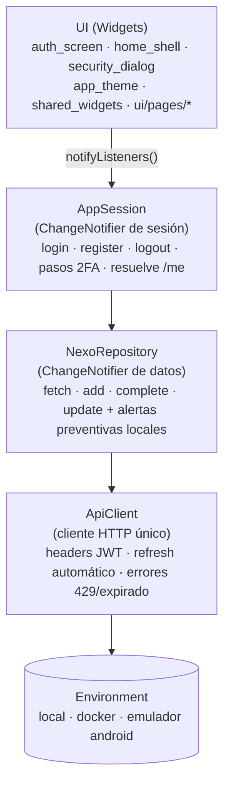
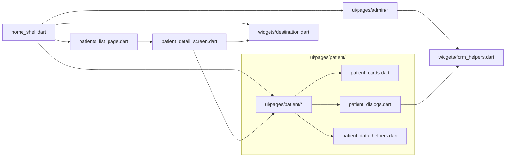
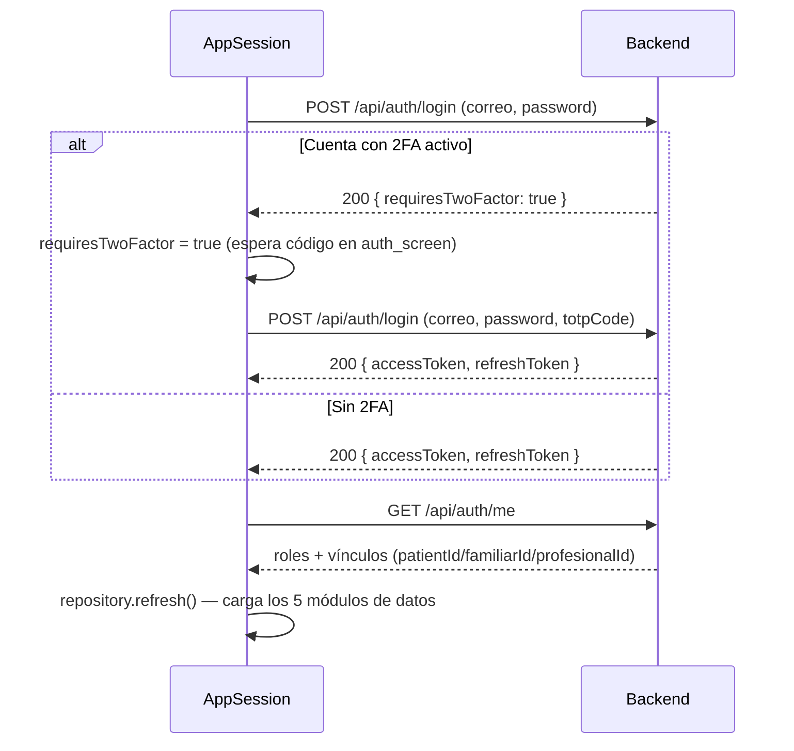

# NexoVida — App Móvil (Flutter)

[](https://flutter.dev)
[](https://dart.dev)
[](https://www.android.com)
[](https://flutter.dev)

Cliente móvil de **NexoVida** en **Flutter (Dart ≥ 3.9)**. La app gestiona sesión (JWT + refresh + **2FA TOTP**), navega por **rol de usuario** y consume los módulos de la API: recordatorios, indicadores de salud (con alertas preventivas locales), citas, alertas e historial clínico.

Volver al [README raíz](../README.md).

---

## Tabla de contenidos

- [Arquitectura](#arquitectura)
- [Estructura](#estructura)
- [Dependencias](#dependencias)
- [Configuración de entorno (sin `.env`)](#configuración-de-entorno-sin-env)
- [Diseño y tema](#diseño-y-tema)
- [Flujo de sesión y 2FA](#flujo-de-sesión-y-2fa)
- [Navegación y permisos por rol](#navegación-y-permisos-por-rol)
- [Módulos de datos](#módulos-de-datos)
- [Pruebas](#pruebas)
- [Ejecución](#ejecución)

---

## Arquitectura

La app separa **estado de sesión**, **datos** y **UI** con `ChangeNotifier` (sin paquete de gestión de estado externo — es el patrón que la documentación oficial de Flutter recomienda para este tamaño de app):



La navegación es **imperativa** (`Navigator`/`MaterialApp.home`, sin router declarativo) — no hay ninguna dependencia de routing en `pubspec.yaml`.

`home_shell.dart` escucha `session`/`repository` con `AnimatedBuilder`, pero **acotado al contenido de la pestaña activa y al ícono de refresco** — el `AppBar` y el `NavigationRail`/`NavigationBar` no se reconstruyen en cada cambio de dato, solo cuando cambia la pestaña seleccionada.

## Estructura

```
mobile/lib/
├── main.dart                       # NexoVidaApp: AuthScreen ↔ HomeShell según sesión
│                                    #   tema claro/oscuro (ThemeMode.system)
├── app_session.dart                # AppSession: login/registro/2FA/logout, resuelve /api/auth/me
├── config/
│   └── environment.dart            # Environment.apiBaseUrl — única fuente de la URL del backend
├── models/
│   └── nexo_models.dart            # AppUser, Reminder, HealthIndicator, Appointment,
│                                    #   CareAlert, ClinicalEvent, LoginResult (+ JSON)
├── services/
│   ├── api_client.dart             # HTTP, headers JWT, retry con refresh, errores tipados
│   └── nexo_repository.dart        # fetch/add/complete/update + alertas preventivas
└── ui/
    ├── app_theme.dart               # Sistema de diseño: paleta, radios, tema claro/oscuro
    ├── auth_screen.dart             # Login/registro — fijo en tema claro (ver "Diseño y tema")
    ├── home_shell.dart              # Shell delgado: navegación por rol, AppBar, rail/bar
    ├── security_dialog.dart         # 2FA: QR (qr_flutter), secreto, verificar, desactivar
    ├── shared_widgets.dart          # PageScaffold, MetricCard, InfoCard, EmptyState, SyncNotice…
    ├── widgets/
    │   ├── destination.dart         # Destination (label + ícono) — compartido por shell y detalle
    │   └── form_helpers.dart        # menuItem, requiredField, metricValue, textValue
    └── pages/
        ├── patients_list_page.dart      # Listado (Profesional ve "a cargo", Familiar "bajo cuidado")
        ├── patient_detail_screen.dart   # Expediente completo de un paciente puntual
        ├── patient/
        │   ├── dashboard_page.dart       # Inicio (paciente)
        │   ├── reminders_page.dart       # Recordatorios
        │   ├── indicators_page.dart      # Indicadores de salud
        │   ├── appointments_page.dart    # Citas
        │   ├── history_page.dart         # Historial clínico
        │   ├── alerts_page.dart          # Alertas (solo lectura)
        │   ├── patient_cards.dart        # Tarjetas de lista + resúmenes
        │   ├── patient_dialogs.dart      # Diálogos crear/editar (4)
        │   └── patient_data_helpers.dart # Filtros por rol sobre NexoRepository
        └── admin/
            ├── admin_users_page.dart     # Gestión de usuarios
            ├── admin_metrics_page.dart   # Métricas del sistema
            └── admin_config_page.dart    # Configuración
```

`home_shell.dart` pasó de un único archivo de ~2000 líneas a un shell de navegación de ~190, con el resto repartido por dominio (paciente / admin / compartido) — cada archivo tiene una sola responsabilidad. Así quedan las dependencias entre esos archivos nuevos:



## Dependencias

`pubspec.yaml` — `environment: sdk: ^3.9.0`

| Dependencia | Versión | Uso |
|-------------|---------|-----|
| `http` | ^1.6.0 | Cliente HTTP para la API |
| `qr_flutter` | ^4.1.0 | QR del secreto 2FA en `security_dialog` |
| `cupertino_icons` | ^1.0.8 | Íconos iOS |
| `flutter_lints` *(dev)* | ^5.0.0 | Estilo/lints |

Asset: `assets/images/nexovida-logo.png`.

> Antes había `auto_route` + `auto_route_generator` + `build_runner` declarados en `pubspec.yaml` sin usarse en ningún lado del código (la navegación siempre fue imperativa). Se quitaron: dependencias sin uso real solo suman peso al build y superficie de mantenimiento sin ningún beneficio.

## Configuración de entorno (sin `.env`)

La URL del backend vive en **un solo lugar**, `lib/config/environment.dart`:

```dart
class Environment {
  static const String apiBaseUrl = local; // <- único valor que se cambia a mano

  static const String local = 'http://127.0.0.1:5005';               // dotnet run
  static const String docker = 'http://localhost:8080';              // docker compose
  static const String androidEmulatorLocal = 'http://10.0.2.2:5005';
  static const String androidEmulatorDocker = 'http://10.0.2.2:8080';
}
```

Para cambiar de backend: reasignar `apiBaseUrl` a uno de los otros tres valores y hacer **hot restart** (es `const`, no se resuelve en caliente). `AppSession.login`/`register` también aceptan un `baseUrl` opcional por pantalla, para apuntar a otra red sin recompilar.

**Por qué esto no es un `.env`, a propósito:** un `.env` tiene sentido en un servidor (como `backend/.env`, que el proceso lee al arrancar y se puede cambiar sin recompilar). En un cliente Flutter compilado a APK, cualquier archivo `.env` empaquetado como asset queda **dentro del binario** igual que un `const` — cambiarlo también exige recompilar, así que no gana la flexibilidad que sí tiene en el backend. Y si el `.env` llegara a tener algo sensible, quedaría en texto plano dentro del APK, tan expuesto como cualquier string del código — un `.env` no protege nada en el cliente. Por eso la config de entorno del móvil es un archivo Dart (`Environment`), no un `.env` + paquete `flutter_dotenv`.

## Diseño y tema

`lib/ui/app_theme.dart` centraliza la paleta y los tokens de toda la app — cualquier color nuevo se agrega ahí, no se declara suelto en una pantalla:

- **Paleta**: teal (`AppTheme.primary`) como color de confianza/calma, coral (`AppTheme.secondary`) como acento de acción, salvia (`AppTheme.tertiary`) para estados saludables/éxito, y un acento aparte para eventos de historial clínico. Elegida siguiendo el patrón más usado en apps de salud/clínicas (confianza + calma sobre colores fríos institucionales).
- **Radio de esquina único** (`AppTheme.radius = 14`) para tarjetas, campos, botones y diálogos — antes había 8/12/20 mezclados según el archivo.
- **Tema claro y oscuro** (`AppTheme.light()` / `AppTheme.dark()`), seleccionado automáticamente por `ThemeMode.system` en `main.dart`.
- **`AuthScreen` se fija siempre en tema claro** (`Theme(data: AppTheme.light(), ...)`) independientemente del modo del sistema: es una superficie de marca con tarjeta y logo de fondo blanco fijo, no una pantalla que deba adaptarse — fijarla evita el bug de texto blanco sobre fondo blanco que salía en modo oscuro cuando dependía del tema global.
- Única animación de la app: un fundido + deslizamiento suave (~420ms) al entrar al login. No hay animaciones por tarjeta ni por ítem de lista — eso es lo que de verdad pesa en pantallas con muchos elementos.

## Flujo de sesión y 2FA

`AppSession.login` implementa el **login en 1 o 2 pasos** de la API:



- El **access token** se adjunta como `Authorization: Bearer …` en cada request, y vive **solo en memoria** (nunca se escribe a disco) — cerrar la app cierra la sesión, a cambio de no tener ningún token expuesto en almacenamiento del dispositivo.
- Si un endpoint responde `401 tokenExpired`, `ApiClient._refresh()` llama a `/api/auth/refresh`, **rota el refresh token** y reenvía la petición una vez, transparente para la UI.
- `security_dialog.dart` permite al usuario autenticado:
  - **Activar**: `POST /api/auth/2fa/setup` → muestra el QR (`qr_flutter`) y el secreto para copiar → confirma con `POST /api/auth/2fa/verify { code }`.
  - **Desactivar**: `POST /api/auth/2fa/disable` (la sesión ya probó el 2FA, por eso es seguro).
- El ícono de escudo en el `AppBar` abre el diálogo de seguridad para todos los roles.
- `logout` revoca el refresh token `server-side` y limpia el estado local aunque la red falle.

## Navegación y permisos por rol

`HomeShell` adapta las pestañas según `AppUser.role` (resuelto con `/api/auth/me`):

| Rol | Pestañas | Puede escribir |
|-----|----------|----------------|
| 👑 **Administrador** | Gestión de Usuarios · Métricas · Configuración | Usuarios del sistema (nunca datos clínicos — el backend lo bloquea explícitamente) |
| 🩺 **Profesional** | Pacientes (a cargo) · Alertas | Recordatorios, indicadores, citas, eventos clínicos de sus pacientes asignados |
| 👨‍👩‍👧 **Familiar** | Pacientes (bajo cuidado) · Alertas | Ninguno — solo lectura del expediente del paciente vinculado |
| 🧍 **Paciente** | Inicio · Recordatorios · Indicadores · Citas · Historial · Alertas | Sus propios recordatorios/indicadores/citas |

`Profesional` y `Familiar` comparten las mismas dos pantallas (reutilización, no es un descuido): lo que cada uno puede *hacer* adentro sí está diferenciado — cada botón de crear/editar está condicionado a `user.role == UserRole.profesional` o `.paciente`, así que un `Familiar` navegando al mismo expediente de paciente queda en modo lectura pura.

El acceso real **se refuerza en el servidor**, no solo en la UI: `DataScope`/`BolaChecker` en el backend filtran cada colección (`Recordatorio`, `IndicadorSalud`, `Cita`, `Alerta`, `HistorialPaciente`, `Paciente`) por el rol y los vínculos (`Tratamiento` para Profesional, `AsistentePaciente` para Familiar) del token — la app nunca es la única barrera.

## Módulos de datos

`NexoRepository.refresh()` lanza en paralelo 5 GETs; si **ninguno** responde muestra `Sin conexión con el backend…`:

| Colección | Ruta API | Carga |
|-----------|----------|-------|
| Recordatorios | `GET /api/Recordatorio` | pendientes/programados |
| Indicadores de salud | `GET /api/IndicadorSalud` | mediciones con tipo/rango |
| Citas | `GET /api/Cita` | agenda (futuras) |
| Alertas | `GET /api/Alerta` | activas/atendidas |
| Historial clínico | `GET /api/HistorialPaciente` | línea de tiempo del paciente |

Acciones: crear recordatorio/indicador/cita/evento (`POST`), completar recordatorio (`POST /api/Recordatorio/{id}/completar`), actualizar recordatorio (`PUT`). Al registrar un indicador fuera de rango, el cliente genera una **alerta preventiva local** (presión ≥ 140/90, glucosa ≥ 180, oxígeno < 92) de prioridad Alta/Media, además de la alerta automática del servidor — es una ayuda visual inmediata en el dispositivo, no reemplaza el pipeline de alertas del backend (no se sincroniza entre dispositivos).

## Pruebas

```bash
cd mobile
flutter pub get
flutter analyze          # sin issues (gate de CI)
dart format --set-exit-if-changed .   # gate de CI (código ya formateado)
flutter test             # widget_test actualizado a Image
```

CI: `.github/workflows/mobile-ci.yml` corre pub get → analyze → format check → test → **build APK debug** sobre la ruta `mobile/**`.

## Ejecución

```bash
# Requisitos: Flutter 3.44 (Dart 3.9) y un backend NexoVida en http://127.0.0.1:5005
cd mobile
flutter pub get

# Ver los dispositivos/plataformas disponibles en tu máquina
# (varía según tu sistema operativo: puede listar Windows, macOS, Linux,
# Chrome, un emulador o dispositivo Android, un simulador iOS, etc.)
flutter devices

# Ejecuta en el dispositivo/plataforma que elijas de esa lista.
# Sin -d, Flutter usa el único dispositivo disponible o te pregunta cuál.
flutter run
# o, apuntando a uno en particular:
flutter run -d <id-del-dispositivo>
```

Si corrés en un **emulador/simulador Android** en vez de en tu máquina directamente, cambiá `Environment.apiBaseUrl` a `androidEmulatorLocal` o `androidEmulatorDocker` (`10.0.2.2` en vez de `127.0.0.1`/`localhost`) — ver [Configuración de entorno](#configuración-de-entorno-sin-env). Corriendo en Windows, macOS o Linux directamente (desktop) o en un dispositivo físico en la misma red, `local`/`docker` funcionan tal cual.

### 🔑 Cuentas de demostración (seed)

| Cuenta (`nexovida-project`) | Rol | Qué verás |
|----------------------|-----|-----------|
| `admin@nexovida.com` | Administrador | Gestión de usuarios, métricas, configuración |
| `jperez@correo.com` | Profesional | Pacientes a cargo (Maria Gonzalez), alertas |
| `rgonzalez@correo.com` | Familiar | Paciente vinculado (su madre, Maria Gonzalez), alertas (solo lectura) |
| `mgonzalez@correo.com` | Paciente | Recordatorios, indicadores, citas, historial |